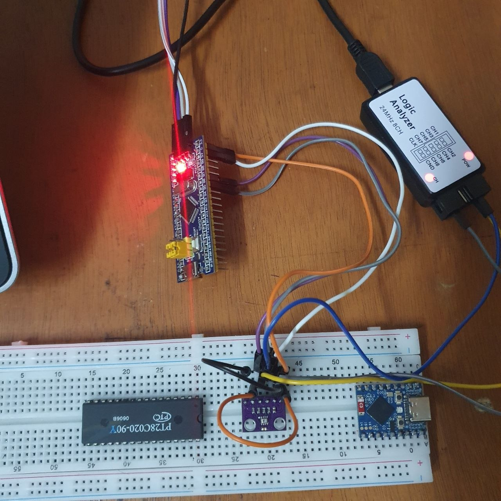
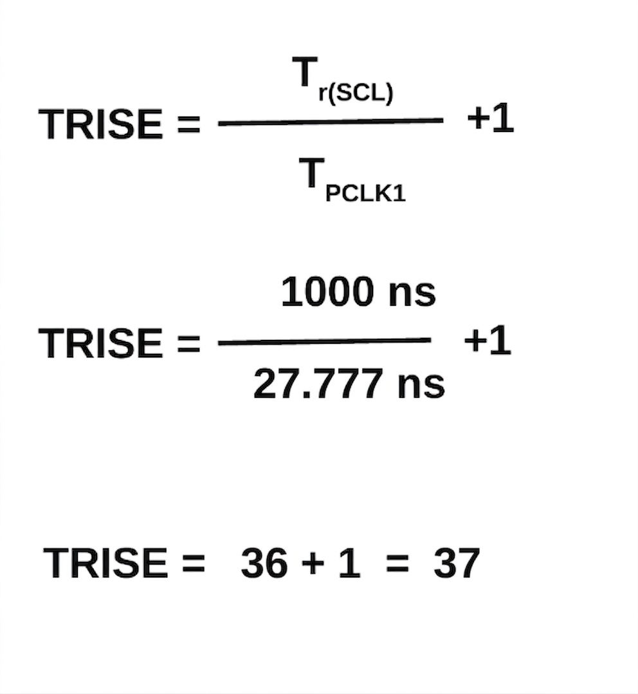
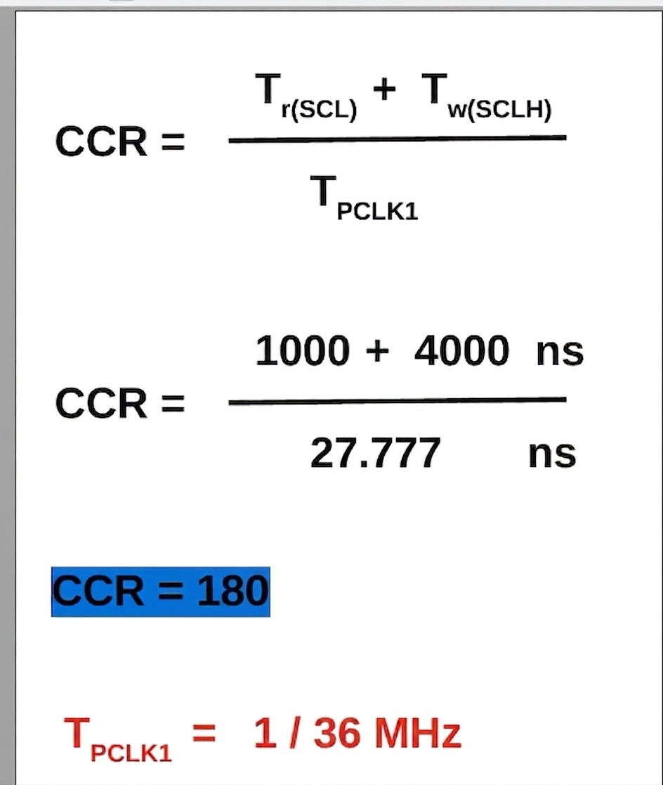
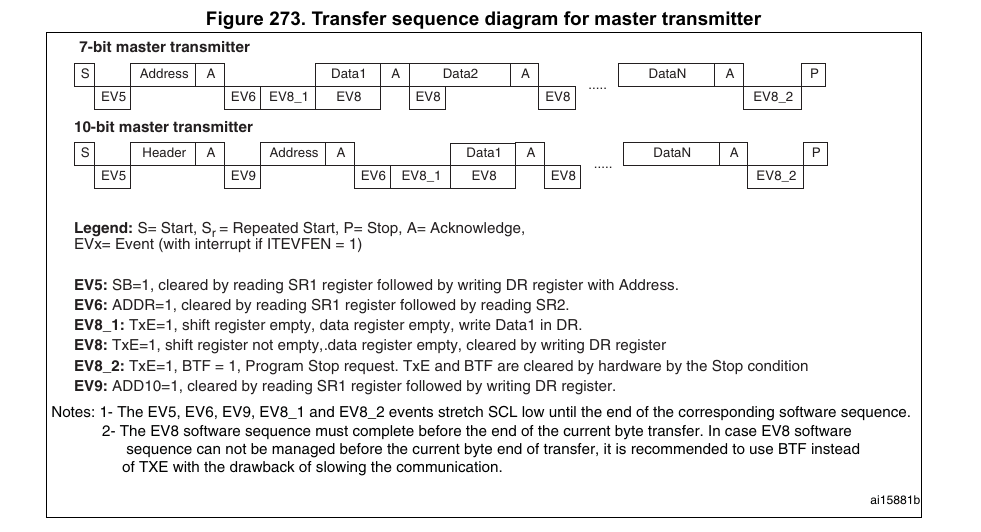
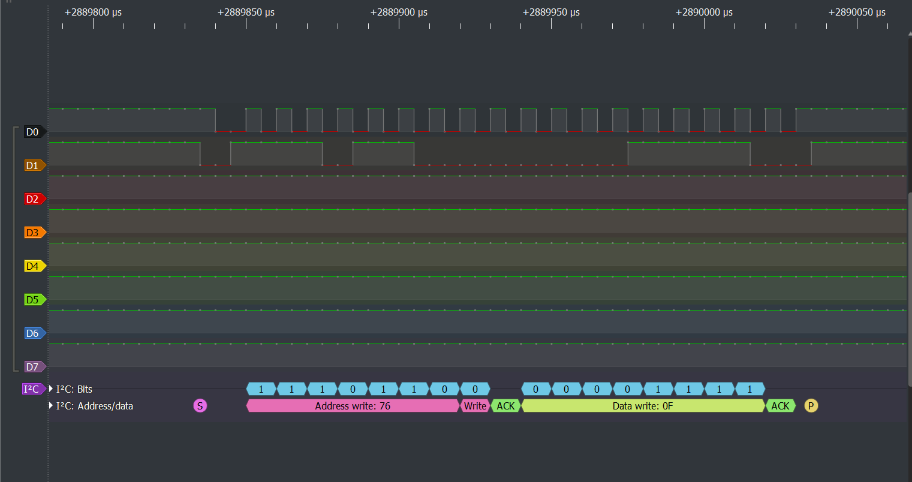

# STM32 Bare-Metal I2C Master Driver

This repository contains a bare-metal I2C Master driver written in C for the STM32 microcontroller (Blue Pill). It demonstrates how to manually configure I2C peripherals, calculate precise timing registers, and manage hardware events to establish two-way communication with a GY-BME280 sensor.

##   Hardware Setup & Wiring

To verify the communication, the physical bus was monitored using a 24MHz 8-channel Logic Analyzer alongside an ST-Link V2 for flashing.

* **Microcontroller:** STM32F103C8T6 (Blue Pill)
* **Sensor:** GY-BME280 / BMP280 Breakout Board
* **Debugging Tool:** 24MHz 8CH Logic Analyzer

**Important Sensor Wiring Note:** Because the GY-BME280 module supports both SPI and I2C, specific pins must be tied to physical logic levels to force I2C mode and set a static address:
* **CSB Pin:** Tied to **3.3V** to disable SPI and force I2C mode.
* **SDO Pin:** Tied to **GND** to lock the I2C 7-bit address to `0x76`.
 
  

  

---

##   I2C Clock Configuration (CCR & TRISE)

To achieve standard mode I2C speed (100kHz) with an APB1 clock frequency of 36MHz, the Clock Control Register (`CCR`) and Maximum Rise Time (`TRISE`) registers were manually calculated. 

### 1. Calculating TRISE
The formula for TRISE in standard mode is `(Tr(SCL) / Tpclk1) + 1`.
* With a maximum rise time of 1000ns and a clock period of 27.777ns (1/36MHz): `(1000ns / 27.777ns) + 1 = 37`.

  

 

### 2. Calculating CCR
The formula for CCR is `(Tr(SCL) + Tw(SCLH)) / Tpclk1`.
* `(1000ns + 4000ns) / 27.777ns = 180`.

  

 
---

##   Master Transmitter Sequence & Hardware Events

This driver avoids standard HAL libraries and operates by directly polling the STM32's Status Registers (`SR1` and `SR2`). The transmission follows the official STM32 Transfer Sequence Diagram.

 

The custom `I2C_write()` function executes the following hardware events:
1.  **Generate START:** The driver sets the START bit and waits for **EV5** (`SB=1`), confirming the STM32 has control of the bus.
2.  **Send Address:** The 7-bit address (`0x76`) shifted left by 1 (with a Write bit of `0`) is loaded into the Data Register (`DR`). The code then waits for **EV6** (`ADDR=1`), indicating the sensor acknowledged the address.
3.  **Send Data:** The driver waits for **EV8_1** (`TxE=1`, shift register empty) before pushing the data payload into the `DR`.
4.  **Confirm Transfer:** The system waits for **EV8_2** (`BTF=1`), verifying the byte transfer finished successfully and the final ACK was received.
5.  **Generate STOP:** The STOP bit is set, releasing the I2C bus.

---

##   Logic Analyzer Verification

To prove the bare-metal code translates correctly to physical electrical signals, the I2C bus was monitored during a test write of data `0x0F` to address `0x76`.

**Decoding the Trace:**
* **S:** Start condition generated by the STM32.
* **Address `0x76` + Write `0`:** The 8 bits successfully clocked out.
* **ACK (Green):** The sensor successfully pulled SDA low on the 9th clock pulse (Triggering EV6 in the code).
* **Data `0x0F`:** The data payload sent by the master.
* **ACK (Green):** The sensor acknowledged the data byte (Triggering EV8_2).
* **P:** Stop condition cleanly releasing the bus.

---

##   Troubleshooting Note
During development, if the sensor responds with a NACK (Not Acknowledge) on the logic analyzer, it usually indicates a hardware or addressing mismatch. Ensure that the sensor's `SDO` and `CSB` pins are strictly tied to power/ground rather than left floating, as floating pins will cause the I2C address to drift and ignore master requests.
