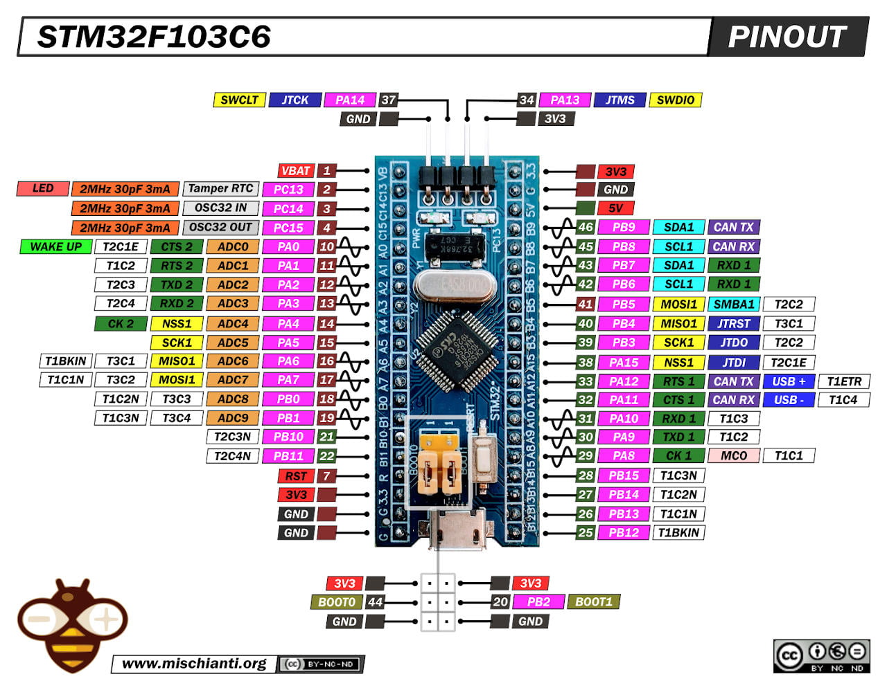
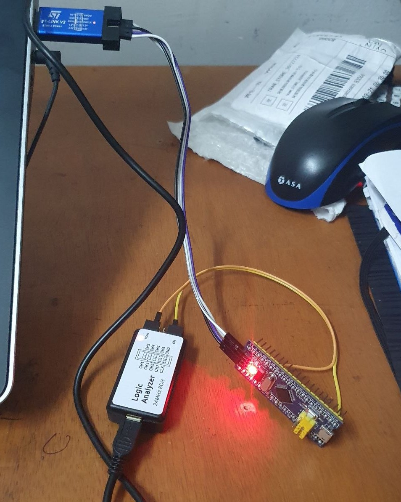

# STM32F103 Bare-Metal Register Programming

A complete collection of bare-metal C drivers for the STM32F103C8T6 (Blue Pill), written entirely from scratch using direct register manipulation. **Zero HAL (Hardware Abstraction Layer) used.** All configurations are based on the official STM32 **RM0008 Reference Manual**.

## 💻 Hardware & Software Setup
* **Board:** STM32F103C8T6 (Blue Pill)
* **Programmer:** ST-Link V2 (SWD Interface)
* **IDE/Compiler:** Keil uVision 5 (MDK-ARM)
* **Language:** Bare-Metal C 

## 📂 Repository Structure
Each folder contains the `main.c` and specific configuration headers for that peripheral.
* `/01_Clock_Config`
* `/02_Timer_Delay`
* `/03_UART_Driver`
* `/04_I2C_Driver`
* `/05_ADC_Driver`
* `/06_EXTI_Interrupts`
* `/07_SPI_Driver`
* `/08_DMA_Controller`

---

## 🚀 Progress Tracker & To-Do List

### Core & Timing
- [x] **System Clock:** Configure HSE, PLL, and set system clock to 72MHz.
- [x] **Timers:** Setup Hardware Timers to generate precise microsecond/millisecond delays.

### Communication Protocols (Wired)
- [ ] **UART (TX/RX):** Configure baud rate, transmit, and receive data (Polling).
- [x] **I2C (Transmit/Receive):** Configure Master mode to communicate with external sensors.
- [ ] **SPI (Master Mode):** High-speed register configuration for external ICs.

### Analog & Advanced Peripherals
- [ ] **ADC (Multi-Channel):** Read analog voltages and internal temperature sensor.
- [ ] **External Interrupts (EXTI):** Configure hardware interrupts via GPIO pins (falling/rising edge triggers).
- [ ] **ADC with DMA:** Offload ADC readings directly to memory without interrupting the CPU.
- [ ] **DMA (Direct Memory Access):** Configure Half-Transfer (HT) and Transfer-Complete (TC) interrupts for ultimate efficiency.

---
**How to use this code:**
Clone the repository, open the specific project folder in **Keil uVision 5**, compile, and flash directly to your Blue Pill using your **ST-Link**. Ensure your ST-Link drivers are installed and configured for SWD in Keil's target debug options.
